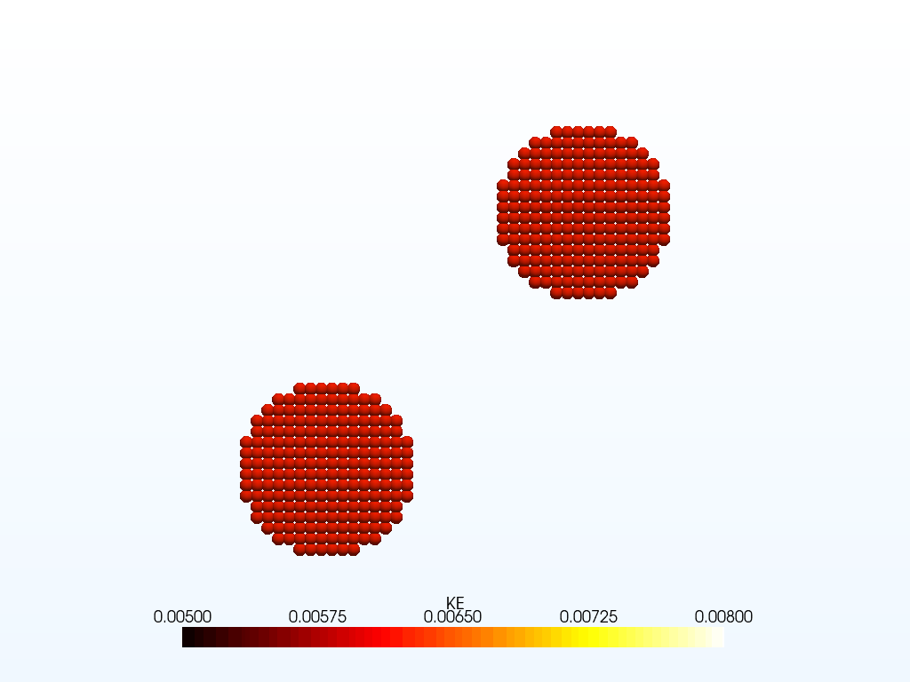

<p align="center" style="margin-bottom: 0px !important; ">
  
</p>

<h1 align="center" style="margin-top: 0px;">PyroclastMPM</h1>
A modular GPU based Material Point Method (MPM) solver.

<!-- 
<p align="center">

</p> -->

<!--  -->

<!-- [](https://pypi.org/project/pyroclastmpm) -->
<!-- [](https://None.readthedocs.io/) -->


# Features

## Implementation
* 1D, 2D, 3D
* C++ / CUDA with
* Python bindings
* Particle volume and surface body fill

## Shape functions
* Linear
* Quadratic
* cubic splines

## Solvers
* Update stress last
* Modified Update Stress Last (in progress)
* Total Lagrangian Material Point Method (MPM) (in progress)
* APIC/MLS (in progress)

## Boundary conditions
* Rigid body level-set (UL)
* DEM-based contacts (TODO)

# Constitutive models
* Linear Elasticity 
* Newtonian Fluid
* Local granular rheology  (in progress)
* Non Local granular rheology  (in progress)
* Druger prager  (in progress)

# Prerequisites

Building PyroclastMPM requires the following software installed:

* A C++11-compliant compiler (required)
* CMake `>= 3.22` (required)
* VTK 9 (required)
* CUDA 10> (required)
* Doxygen (optional, documentation building is skipped if missing)* Python `>= 3.8` for building Python bindings
 
# Installation

The following sequence of commands install PyroclastMPM.
## Python package


# Source file


It assumes that your current working directory is the top-level directory
of the freshly cloned repository:

```
mkdir build
cd build
cmake -DCMAKE_BUILD_TYPE=Release ..
cmake --build .
```

The build process can be customized with the following CMake variables,
which can be set by adding `-D<var>={ON, OFF}` to the `cmake` call:

* `BUILD_TESTING`: Enable building of the test suite (default: `ON`)
* `BUILD_DOCS`: Enable building the documentation (default: `ON`)
* `BUILD_PYTHON`: Enable building the Python bindings (default: `ON`)


If you wish to build and install the project as a Python project without
having access to C++ build artifacts like libraries and executables, you
can do so using `pip` from the root directory:

```
python -m pip install .
```

# Testing PyroclastMPM

When built according to the above explanation (with `-DBUILD_TESTING=ON`),
the C++ test suite of `PyroclastMPM` can be run using
`ctest` from the build directory:

```
cd build
ctest
```

The Python test suite can be run by first `pip`-installing the Python package
and then running `pytest` from the top-level directory:

```
python -m pip install .
pytest
```

# Documentation

PyroclastMPM provides a Sphinx-based documentation, that can
be browsed [online at readthedocs.org](https://pyroclastmpm.readthedocs.io).
To build it locally, first ensure the requirements are installed by running this command from the top-level source directory:

```
pip install -r doc/requirements.txt
```

Then build the sphinx documentation from the top-level build directory:

```
cmake --build . --target sphinx-doc
```

The web documentation can then be browsed by opening `doc/sphinx/index.html` in your browser.
